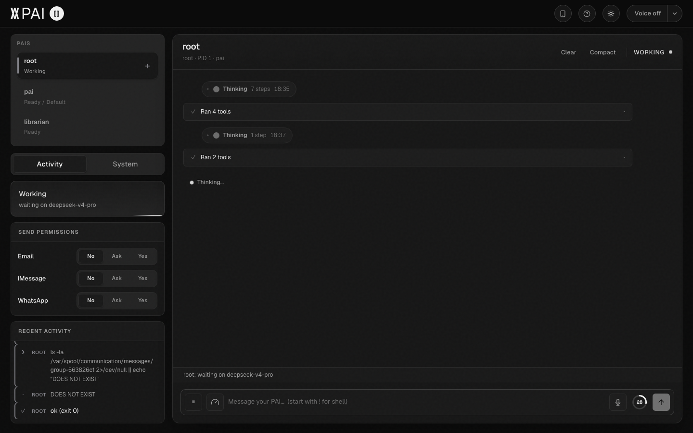
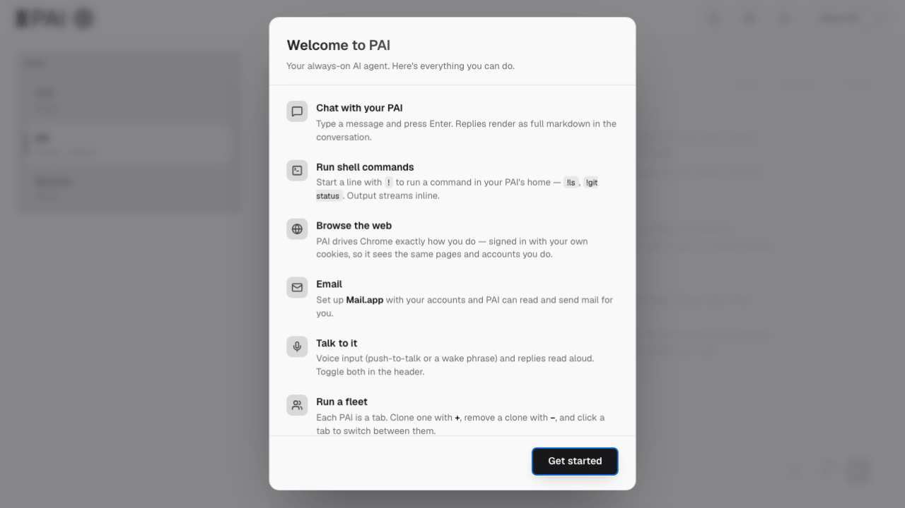

# Ambiance

**Ambiance is an always-on personal AI assistant for macOS, built like a tiny Unix system.**

It runs a supervised fleet of AI agents against a plain-text filesystem at
`~/.pai`: your fleet is declared in `/etc/config.yaml`, running agents show up
under `/proc/`, drivers (email, calendar, iMessage, WhatsApp, voice, browser)
write ordinary files you can `rg`, `tail`, and `cat` — and when your AI does
something surprising, you can read the exact prompt it saw.

No database. No SaaS. The filesystem *is* the data structure.

Ambiance is currently an alpha for technical users. It is useful, hackable,
and intentionally transparent — not yet a polished consumer app or a hosted
service.

## Install

One line, no prerequisites (no git, no Node, no compiler — the script installs
`uv` and pulls a prebuilt, checksum-verified release):

```bash
curl -fsSL https://raw.githubusercontent.com/whitematterlabs/ambiance/main/install.sh | sh
```

Piping curl into sh deserves suspicion — [read install.sh](install.sh) first.
It provisions the runtime at `~/.pai`, asks for a model provider key
(Anthropic, OpenAI, DeepSeek, or z.ai), and offers an interactive capability
picker. Then:

```bash
pai start          # terminal UI
pai start --web    # browser console at localhost:8787
pai start --headless
```

Developers work from a checkout instead, which keeps source edits live:

```bash
git clone https://github.com/whitematterlabs/ambiance.git
cd ambiance
uv sync && uv run paifs-init
```

(A dev checkout builds the web surface with `pnpm`; release tarballs ship it
prebuilt.)

## What it does

- Runs one or more long-lived AI agents as a supervised local fleet — clone
  them, stop them, talk to any of them from one console.
- Routes external events from drivers: email, calendar, iMessage, WhatsApp,
  notifications, voice, and browser/computer-use tools.
- Gates outbound sending per channel — email, iMessage, and WhatsApp are each
  **no / ask / yes**, switchable live from the console.
- Stores everything as plain files under `~/.pai`: memory is markdown, your
  email archive is a directory tree designed for ripgrep, logs are logs.
- Installs capabilities (drivers, skills, tools, agent bundles) from the
  companion [pairegistry](https://github.com/whitematterlabs/pairegistry).

The kernel is a pure-Python, fully event-driven supervisor: it sleeps until a
file changes or a timer fires. No polling loops, nothing burning your battery.

Here is an agent mid-task — tool runs fold into the transcript, and the
sidebar streams the shell commands it is running:



<details>
<summary>First-run tour</summary>
<br>

</details>

## Status and expectations

Ready today:

- macOS local runtime (Apple Silicon tested)
- Python kernel, terminal TUI, and React/Vite local web console
- Registry-installed drivers, skills, tools, prompts, and PAI bundles
- API-key model providers: `ANTHROPIC_API_KEY`, `OPENAI_API_KEY`,
  `DEEPSEEK_API_KEY`, or `ZAI_API_KEY`

Not ready yet:

- Hosted deployment or public remote web access
- Broad non-technical onboarding
- Stable signed macOS app distribution
- Strong sandboxing or privilege separation for untrusted code
- Versioned registry release channels

**Do not expose `pai start --web` to the public internet.** The local web
surface includes owner-level controls: shell execution, kernel lifecycle,
provider switching, clone/delete, and message sending.

You will also need macOS permission grants for whichever drivers you enable
(Contacts, Calendar, Messages, Mail, Accessibility, Microphone).

## Updating

```bash
pai update --check   # see what's new
pai update           # update
pai update --rollback
```

For a tarball install, `pai update` downloads the latest release into a new
`~/.pai/opt/pai/<version>/`, reprovisions, and repoints `current` — your state
under `etc/`, `var/`, and `home/` is untouched. For a dev checkout it pulls
git, refreshes dependencies, rebuilds the web frontend, and reprovisions shims
(refusing to pull over local changes).

## Companion registry

This repository contains the kernel and privileged tools. Most user-facing
capability lives in [pairegistry](https://github.com/whitematterlabs/pairegistry)
as installable packages: `drivers/`, `skills/`, `lib/`, `bin/`, `sbin/`,
`prompts/`, `pais/`, `subagents/`.

```bash
paiman list
paiman install imessage
paiman install email-pai
paisetup            # interactive picker
```

The default registry is configured in `paiman`; set `PAIMAN_REGISTRY` to point
at a local checkout or another source.

## Runtime layout

PAI provisions a quasi-Linux filesystem under `$PAI_ROOT` (default `~/.pai`):

| Path | Purpose |
| --- | --- |
| `/boot` | Kernel image and helpers |
| `/usr` | Installed userspace packages and docs |
| `/sbin` | Privileged runtime management tools |
| `/bin` | PAI-callable tools |
| `/etc` | Fleet and provider configuration |
| `/proc` | Runtime process state |
| `/sys` | Driver runtime state |
| `/var` | Instance state, event spools, memory, logs |
| `/home` | Per-PAI stitched home views |
| `/opt` | Installed package staging area |

The authoritative spec is
[`src/usr/share/doc/FILESYSTEM_v3.md`](src/usr/share/doc/FILESYSTEM_v3.md).

## Architecture

Three layers:

- **Kernel** — `src/boot/`, a Python event loop that supervises drivers,
  timers, routing, and PAI subprocesses. It routes events; it does not know
  what a "message" is. On-disk shape belongs to drivers.
- **Privileged tools** — `src/sbin/` and selected `src/bin/` commands for
  install, fleet config, lifecycle, packages, and runtime state.
- **Userspace packages** — drivers, skills, prompts, tools, and PAI bundles
  installed from `pairegistry`.

Owner surfaces (TUI, web console, or nothing at all in `--headless`) attach to
the kernel; they do not own it.

More detail:

- [`development_docs/OVERVIEW.md`](development_docs/OVERVIEW.md)
- [`src/usr/share/doc/KERNEL_ARCHITECTURE.md`](src/usr/share/doc/KERNEL_ARCHITECTURE.md)
- [`src/usr/share/doc/KERNEL.md`](src/usr/share/doc/KERNEL.md)
- [`src/usr/libexec/web/README.md`](src/usr/libexec/web/README.md)
- [`src/usr/share/doc/PAIMAN.md`](src/usr/share/doc/PAIMAN.md)

## Development

```bash
uv sync                        # deps
uv run python -m pytest        # tests
uv run paifs-init --no-setup   # reprovision ~/.pai after source changes
```

Web UI:

```bash
cd src/usr/libexec/web
pnpm install
pnpm build     # or: pnpm dev, with `python -m usr.libexec.web.pai_web` alongside
```

Cut a release tarball with `pairelease` (needs `pnpm`, `git`, and `gh` for
`--publish`).

### Repository boundaries

Use this repo for kernel code (`src/boot/`), privileged tools (`src/sbin/`,
`src/bin/`), kernel docs (`src/usr/share/doc/`), and the web owner surface
(`src/usr/libexec/web/`). Drivers, skills, libraries, prompts beyond the kernel
seeds, and PAI/subagent bundles belong in `pairegistry` — changing the wrong
repository is the most common development mistake.

## Security and privacy

PAI is local-first, but it is powerful software. It can read and write local
files, run shell commands through owner-authorized tools, access enabled macOS
surfaces, and call the model providers you configure — your data lives in
plain files on your machine; inference goes to the provider you choose.

Before installing or enabling packages:

- Read package manifests and hooks.
- Understand what macOS permissions you are granting.
- Keep API keys in your local environment or `$PAI_ROOT/.env`.
- Do not expose the local web UI to untrusted networks.
- Do not install untrusted registry packages.

The runtime is intended to be inspectable: logs, process state, config,
memory, and event spools are ordinary files under `$PAI_ROOT`. If you hate it,
`rm -rf ~/.pai` removes every trace.

## Troubleshooting

| Symptom | Try |
| --- | --- |
| Runtime layout missing or stale | `uv run paifs-init --no-setup` |
| Web UI does not load (dev checkout) | `cd src/usr/libexec/web && pnpm install && pnpm build` |
| A package is missing | `paiman install <name>` |
| Fleet inspection | `paictl status`, `paictl logs <name>` |
| Kernel logs | `$PAI_ROOT/var/log/kernel/kernel.log` |

## License

PAI is licensed under the [Apache License 2.0](LICENSE). See
[`NOTICE`](NOTICE) for attribution.
